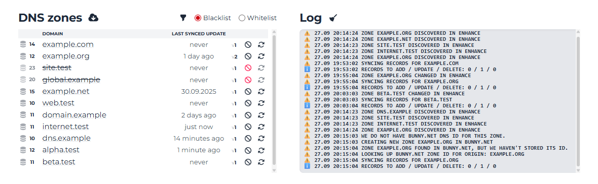

# Enhance CP → Bunny.net DNS sync

This tool syncs DNS records from Enhance CP to the Bunny.net DNS service.

The script was created for personal use and **may contain bugs**, as it hasn't been thoroughly tested in various environments.
Please report any problems via GitHub issues.

_Web UI_

## Sync logic

Zone synchronization is one-way and is triggered by:
* Creating a new DNS zone in Enhance CP
* Changes in records of an existing DNS zone in Enhance CP

Changes made in Bunny.net do not trigger synchronization.

|            | Enhance CP    | Bunny.net     | Action                                      |
|------------|---------------|---------------|---------------------------------------------|
| DNS zone   | Exists        | Doesn't exist | Create zone in Bunny.net and sync it        |
| DNS zone   | Exists        | Exists        | Mirror records from Enhance CP to Bunny.net |
| DNS zone   | Doesn't exist | Exists        | Do nothing                                  |
| DNS record | Exists        | Doesn't exist | Create record in Bunny.net                  |
| DNS record | Doesn't exist | Exists        | Delete record from Bunny.net                |

Be careful:
* If a DNS zone is in Bunny.net but not in Enhance CP, the script will **DO NOTHING** with this zone.
* If a DNS record is in Bunny.net but not in Enhance CP, the script will **REMOVE** this record from Bunny.net.

For safer and more controlled syncing, configure either whitelist or blacklist mode in the web UI or `config.php` 
In blacklist mode, **ALL DNS ZONES** are synced **EXCEPT** those listed in `dns_zones_list`. 
In whitelist mode, **NO DNS ZONES** are synced **EXCEPT** those listed in `dns_zones_list`.

Currently supported record types: **A**, **AAAA**, **CNAME**, **MX**, **NS**, **TXT** 
Records of other types are ignored.

## Installation

1. Create a blank PHP 8.4 website, for example: `dns-sync.example.com`.
   It is recommended to use the same server where Enhance CP is installed.
   Enable HTTPS for the site.
2. [Download](https://github.com/comandante-fidel/enhance-bunny-dns-sync/releases/download/v1.0.0/enhance-bunny-dns-sync_1.0.0-release.zip) and extract the release of the sync script.
   The `public_html` directory from the archive must match the webserver root of the website.
3. Rename `config.sample.php` to `config.php` and fill it with your keys and settings.
   * `enhance_api_key` – in your Enhance CP navigate to **Settings** → **Access tokens**
     and create a token with access level `System administrator`.
   * `enhance_organization_id` – use the `orgId` value from the same page
   * `enhance_host` – enter your panel's hostname without *https://*. For example: `cp.example.com`
   * `bunny_api_key` – open https://dash.bunny.net, navigate to **Account settings** → **API key**
   * `custom_nameservers` – specify the custom nameservers you use with Bunny.net.
     Example: `['ns1.example.com', 'ns2.example.com']` 
     If you're not using custom nameservers, leave this array blank: `[]` 
     It means your domains should point to Bunny.net's nameservers: *kiki.bunny.net* and *coco.bunny.net*
   * Specify a password for the web panel (`web` `password`), change the username (`web` `username`) if needed.
4. Open the website you created in the first step in your browser, enter your login and password. If you specified all the parameters correctly,
   during the first run, the script will load all domains from Enhance CP **without running synchronization**. Using the web interface you can switch between whitelist/blacklist mode,
   include or exclude DNS zones from synchronization and run manual sync for specific domains.
   If sync fails to run, check the log for errors (enable `system` `debug` in config for verbose info).
5. If everything goes as it should in web UI, open the shell and run: `php cli.php`.
   Do not run as root. If you're using Enhance CP, pick credentials from the site settings:
   **Advanced** → **Developer tools** → **SSH password authentication** (using a key via **SSH key manager** is even better).
6. Add the task `php cli.php` to your cron scheduler. 
   In Enhance CP, this is available in the site settings: **Advanced** → **Developer tools** → **Cron jobs**. 
   Choose the frequency based on how long synchronization takes when started manually. 
   The `cli.php` script is protected against concurrent runs, but if you have many sites,
   you should consider using cron intervals longer than one minute.

## Debug and development

* To start modifying, copy the repository and run: `npm install`
* To compile `public_html/web.min.css`, run: `npm run compile-web-css`
* Enable debugging in your `config.php` to turn on error output and make logs verbose.

## Licensing

You can use the code (original or modified) in both non-commercial and commercial projects «under the hood»,
but please do not redistribute it (see LICENSE file for details).
To suggest changes or improvements, open an issue on GitHub or make a pull request.

If you want to thank the author, you can:
* Hire me to install or modify the script (or for other PHP / hosting related work). Contact e-mail: [fidel@fidel.im](mailto:fidel@fidel.im)
* Support development with a donation: https://fidel.im/donate
* Join Bunny.net using my referral link: https://bunny.net/?ref=m7of8wpk0b